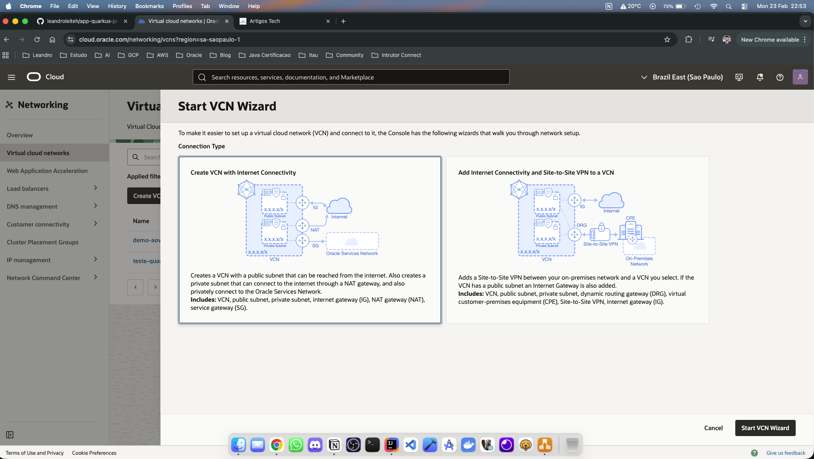
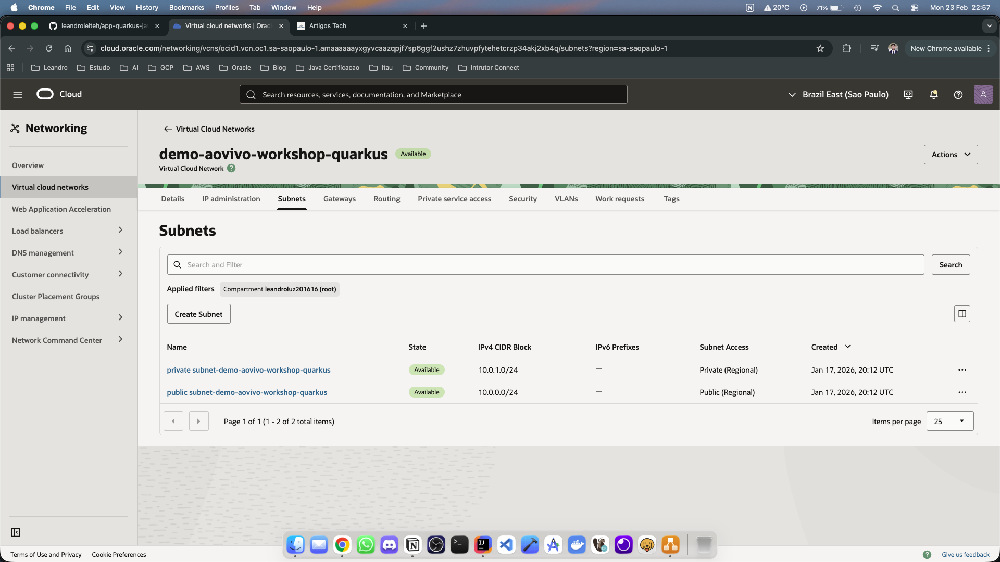
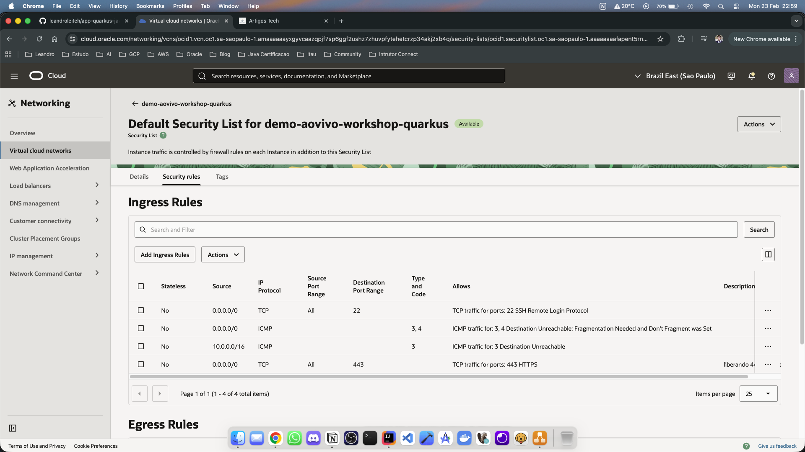
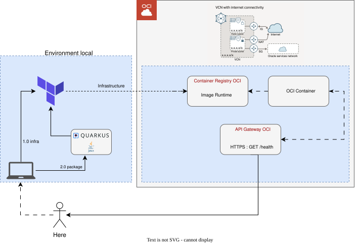

# Hospedando Aplicação Java Quarkus na Oracle Cloud Infrastructure (OCI) Container Instances

Este guia descreve o processo passo a passo para hospedar uma aplicação Java Quarkus utilizando OCI Container Instances, desde a configuração inicial até o deploy automatizado via Terraform.

> **Nota Importante**: O foco deste artigo **não é ensinar como construir uma aplicação Java complexa**, mas sim demonstrar o processo de infraestrutura e deploy serverless na OCI. A aplicação utilizada aqui é intencionalmente simples para facilitar o entendimento do fluxo de deploy.

## Pré-requisitos

Antes de começar, certifique-se de ter as seguintes ferramentas e contas configuradas:

1.  **Conta na Oracle Cloud Infrastructure (OCI)**:
    *   Crie uma conta gratuita em: [https://signup.cloud.oracle.com/](https://signup.cloud.oracle.com/?sourceType=_ref_coc-asset-opcSignIn&language=en_US)
    *   **Benefícios**: A OCI oferece um nível gratuito generoso ("Always Free") que inclui recursos de computação, armazenamento e rede, ideal para aprendizado e projetos pequenos sem custo.
2.  **OCI CLI Instalada e Configurada**:
    *   Siga a documentação oficial para instalação: [OCI CLI Install](https://docs.oracle.com/en-us/iaas/Content/API/SDKDocs/cliinstall.htm)
    *   Configure suas credenciais (`~/.oci/config`) com seu User OCID, Tenancy OCID, Fingerprint e Private Key.
3.  **Terraform ou OpenTofu**:
    *   Terraform: [Instalação](https://developer.hashicorp.com/terraform/install)
    *   OpenTofu: [Instalação](https://opentofu.org/docs/intro/install/)
4.  **Java JDK 21+ e Maven**:
    *   Necessário para compilar a aplicação Quarkus.
5.  **Docker ou Podman**:
    *   Para construir e enviar a imagem do container.

---

## 1. Configuração da Infraestrutura de Rede na OCI

Antes de provisionar os recursos via Terraform, é necessário configurar a rede (VCN) e as subnets no console da OCI.

### Passo 1.1: Criar VCN e Subnets (Usando o Wizard)

Para facilitar, utilize o **VCN Wizard** no console da OCI, que cria automaticamente a VCN, subnets pública e privada, e gateways necessários.

1.  Acesse o console da OCI.
2.  Navegue até **Networking > Virtual Cloud Networks**.
3.  Clique em **Start VCN Wizard**.
4.  Selecione **Create VCN with Internet Connectivity**.
5.  Siga os passos para criar:
    *   **Public Subnet**: Será usada para o API Gateway (acesso externo).
    *   **Private Subnet**: Será usada para a Container Instance (acesso interno apenas).



### Passo 1.2: Configurar Security Lists

Configure as regras de firewall (Security Lists) para permitir o tráfego necessário.

#### **Private Subnet – Security List**
Permite que o API Gateway (ou recursos na VCN) acessem a aplicação na porta 8080.

| Direção | Origem | Protocolo | Porta | Descrição |
| :--- | :--- | :--- | :--- | :--- |
| Ingress | `10.0.0.0/16` (CIDR da VCN) | TCP | 8080 | Tráfego interno para a app |

#### **Public Subnet – Security List**
Permite acesso externo ao API Gateway.

| Direção | Origem | Protocolo | Porta | Descrição |
| :--- | :--- | :--- | :--- | :--- |
| Ingress | `0.0.0.0/0` | TCP | 80 | HTTP |
| Ingress | `0.0.0.0/0` | TCP | 443 | HTTPS |




---

## 2. A Aplicação Java Quarkus

A aplicação é um microsserviço simples utilizando Quarkus. O objetivo aqui é demonstrar o deploy, mas você pode expandir conforme necessário.

### Gerando o Projeto (Opcional)

Se você quiser criar um projeto do zero, utilize o [code.quarkus.io](https://code.quarkus.io/).
*   Selecione as extensões desejadas (ex: RESTEasy).
*   Baixe o zip e abra na sua IDE.

### Código Fonte (`ExampleResource.java`)

O endpoint `/up` retorna uma mensagem simples para validar o funcionamento.

```java
package com.leandroleiteh;

import jakarta.ws.rs.GET;
import jakarta.ws.rs.Path;
import jakarta.ws.rs.Produces;
import jakarta.ws.rs.core.MediaType;

@Path("/up")
public class ExampleResource {

    @GET
    @Produces(MediaType.TEXT_PLAIN)
    public String hello() {
        return "Hello from Container instances OCI";
    }
}
```

### Build da Imagem Docker

O Quarkus já fornece Dockerfiles otimizados na pasta `src/main/docker`. Vamos usar a versão JVM.

1.  Compile o projeto:
    ```bash
    ./mvnw package
    ```
2.  Construa a imagem Docker:
    ```bash
    docker build -f src/main/docker/Dockerfile.jvm -t seu-region.ocir.io/sua-tenancy/nome-imagem:tag .
    ```

> **Nota**: O Quarkus facilita a criação de imagens nativas e JVM. Neste exemplo, usamos a JVM para simplicidade.

---

## 3. Infraestrutura como Código (Terraform)

Utilizamos Terraform para provisionar o Container Repository, a Container Instance e o API Gateway. Abaixo, detalhamos cada arquivo da infraestrutura.

### `infra/provider.tf`
Configura o provider da OCI e a região.

```hcl
terraform {
  required_version = ">= 1.5.0"
  required_providers {
    oci = {
      source = "oracle/oci"
      version = "7.30.0"
    }
  }
}

provider "oci" {
  region = "sa-saopaulo-1"
}
```

### `infra/variables.tf`
Define as variáveis para tornar o código reutilizável (OCIDs, nomes, imagem).

```hcl
variable "region" { type = string }
variable "tenancy_id_compartment" { type = string; description = "OCID da compartment" }
variable "subnet_public" { type = string; description = "OCID da subnet publica (para o Gateway)" }
variable "subnet_private" { type = string; description = "OCID da subnet privada (para o container)" }
variable "name_project" { type = string }
variable "image_url" { type = string; description = "Imagem do container a ser usado" }
```

### `infra/main.tf`
Define os recursos principais: Container Repository, Container Instance e API Gateway.

```hcl
resource "oci_artifacts_container_repository" "repo" {
  compartment_id = var.tenancy_id_compartment
  display_name = var.name_project
  is_immutable = false
  is_public = true
}

data "oci_identity_availability_domains" "ads" {
  compartment_id = var.tenancy_id_compartment
}

resource "oci_container_instances_container_instance" "test_container_instance" {
  availability_domain = data.oci_identity_availability_domains.ads.availability_domains[0].name
  compartment_id      = var.tenancy_id_compartment

  shape_config {
    ocpus         = 1
    memory_in_gbs = 2
  }

  vnics {
    subnet_id = var.subnet_private
  }

  containers {
    display_name = var.name_project
    image_url    = var.image_url

    environment_variables = {
      QUARKUS_HTTP_HOST = "0.0.0.0"
      QUARKUS_HTTP_PORT = "8080"
    }
  }
  shape = ""
}

resource "oci_apigateway_gateway" "api_gateway" {
  compartment_id = var.tenancy_id_compartment
  endpoint_type  = "PUBLIC"
  subnet_id      = var.subnet_public
  display_name   = "${var.name_project}-gateway"
}

resource "oci_apigateway_deployment" "api_deployment" {
  compartment_id = var.tenancy_id_compartment
  gateway_id     = oci_apigateway_gateway.api_gateway.id
  display_name   = "${var.name_project}-deployment"
  path_prefix    = "/v1"

  specification {
    routes {
      path    = "/up"
      methods = ["GET"]
      backend {
        type = "HTTP_BACKEND"
        url = "http://${oci_container_instances_container_instance.test_container_instance.vnics[0].private_ip}:8080/up"
        connect_timeout_in_seconds = 10
        read_timeout_in_seconds    = 30
      }
    }
  }
}
```

### `infra/outputs.tf`
Exibe informações úteis após o deploy, como a URL final.

```hcl
output "namespace_registry" {
  value = oci_artifacts_container_repository.repo.namespace
}

output "container_private_ip" {
  value = oci_container_instances_container_instance.test_container_instance.vnics[0].private_ip
}

output "url_final_para_teste" {
  value = "https://${oci_apigateway_gateway.api_gateway.hostname}/v1/up"
}
```

### Executando o Terraform

1.  Inicialize o Terraform:
    ```bash
    cd infra
    terraform init
    ```

2.  Crie um arquivo `terraform.tfvars` com seus valores:
    ```hcl
    region                 = "sa-saopaulo-1"
    tenancy_id_compartment = "ocid1.compartment.oc1..aaaa..."
    subnet_public          = "ocid1.subnet.oc1.sa-saopaulo-1.aaaa..."
    subnet_private         = "ocid1.subnet.oc1.sa-saopaulo-1.aaaa..."
    name_project           = "app-quarkus-demo"
    image_url              = "gru.ocir.io/seu-namespace/app-quarkus-demo:latest"
    ```

3.  Aplique a infraestrutura:
    ```bash
    terraform apply
    ```

Para ver o passo a passo completo, assista ao vídeo: https://www.youtube.com/watch?v=BTE7-e92xcQ

## 4. Deploy e Teste

### Passo 4.1: Push da Imagem para o OCI Registry

Após criar o repositório via Terraform, faça o login e push da imagem:

1.  Login no OCI Registry:
    ```bash
    docker login <region-key>.ocir.io
    ```
    *   Usuário: `<tenancy-namespace>/<username>`
    *   Senha: Auth Token gerado no console OCI.

2.  Push da imagem:
    ```bash
    docker push <region-key>.ocir.io/<tenancy-namespace>/app-quarkus-demo:latest
    ```

### Passo 4.2: Testando a Aplicação

Após o deploy, a aplicação estará acessível através do API Gateway.

O Terraform irá exibir a URL final no output `url_final_para_teste`.

Exemplo de comando para teste:
```bash
curl https://<api-gateway-hostname>/v1/up
```

Exemplo de resposta esperada:
```
Hello from Container instances OCI
```

---

## Boas Práticas e Segurança

Ao levar aplicações para produção, é fundamental seguir padrões de segurança e arquitetura robustos.

1.  **Segurança**:
    *   Nunca exponha o container diretamente à internet; use sempre um API Gateway ou Load Balancer.
    *   Utilize Security Lists e Network Security Groups (NSGs) restritivos.
    *   Gerencie segredos (senhas, chaves) utilizando o OCI Vault, e não hardcoded no código ou variáveis de ambiente simples.

2.  **Cloud Native e 12-Factor App**:
    *   Para construir aplicações resilientes e escaláveis, siga a metodologia **The Twelve-Factor App**.
    *   Saiba mais em: [12factor.net](https://12factor.net/pt_br/)

3.  **CI/CD (Integração e Entrega Contínua)**:
    *   Em um cenário real, o deploy da infraestrutura e da aplicação deve ser automatizado via esteira (pipeline).
    *   Recomendamos o uso do **GitHub Actions** (gratuito para repositórios públicos) para automatizar o build do Docker, push para o Registry e apply do Terraform.

---

## Diagrama da Solução



O fluxo da requisição é:
1.  Usuário acessa URL pública do API Gateway.
2.  API Gateway (Subnet Pública) encaminha para a Container Instance.
3.  Container Instance (Subnet Privada) processa e retorna a resposta.

---

## Referências

*   [OCI Terraform Provider](https://registry.terraform.io/providers/oracle/oci/latest/docs)
*   [Quarkus Guides](https://quarkus.io/guides/)
*   [OCI Container Instances Documentation](https://docs.oracle.com/en-us/iaas/Content/container-instances/home.htm)
